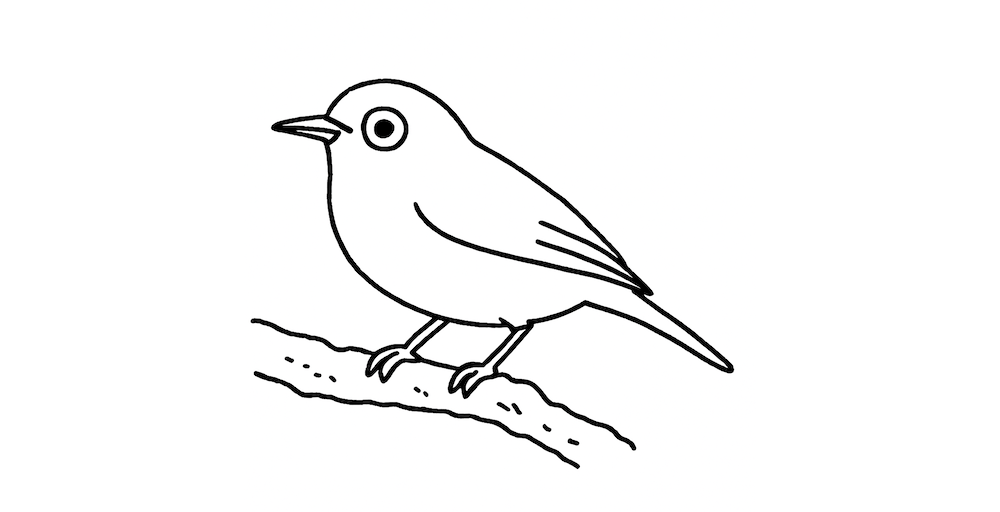

---

# mejiro-cli

**mejiro-cli** is a tiny blog management CLI tool, inspired by the **mejiro** (a small bird in Japan). This CLI helps you manage a small, personal blog by creating new posts and compiling Markdown files into static HTML.


## ✨ Features

- **New Post**: Quickly create a new Markdown article.
- **Compile**: Compile your Markdown posts into static HTML files you can serve anywhere.
- **Image Management**: Store and copy images used in your posts.
- **List Posts**: View metadata for your blog posts.

## 🚀 Installation

```bash
curl -fsSL https://raw.githubusercontent.com/tsugumi-sys/mejiro/main/install/install.sh | bash
```


## 📦 Usage

```bash
mejiro-cli init
```

This will create:
- mejiro.yml (default config)
- posts/ (empty posts directory)
- style.css (default styling)
- icon.png (default icon)


```bash
mejiro-cli mew
```

This will Creates a new article in Markdown format.

```bash
mejiro-cli compile
```

This compiles your Markdown posts into static HTML files.

```bash
mejiro-cli image add ./path/to/image.png
```

Use the `image` command to add and list images stored for your blog.

```bash
mejiro-cli list
```

List post metadata stored in the `posts` directory. Use `-a` to include
unpublished drafts.


## About

Mejiro (メジロ) means "tiny bird" in Japanese.

This CLI is designed for minimal and portable blog workflows.

## 📄 License

Licensed under MIT OR Apache-2.0.
